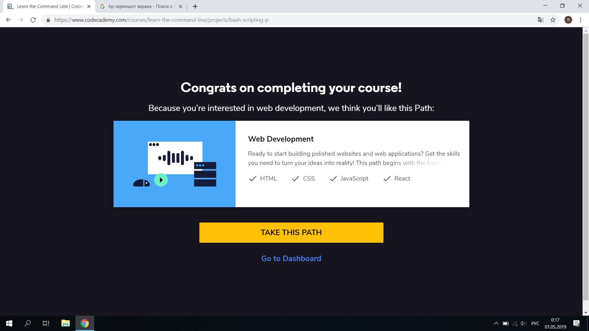
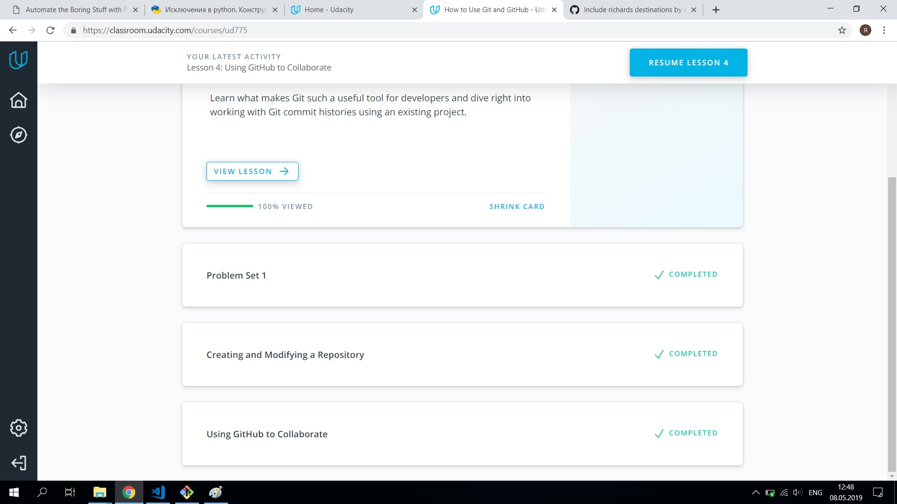
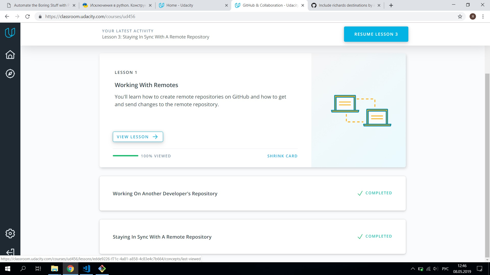

# kottans-frontend
Good course. GIT it is a really powerful tool. Everything is stated briefly and to the point, without unnecessary details, which, if necessary, can be found with - help. Something turns out, something does not work yet, I will study further.

## Linux CLI, and HTTP

With git and the command line was already familiar, refreshed and supplemented their knowledge.
I learned what cookies, cache and sockets are.

## Git Collaboration

Complemented and deepened their lower git and github.